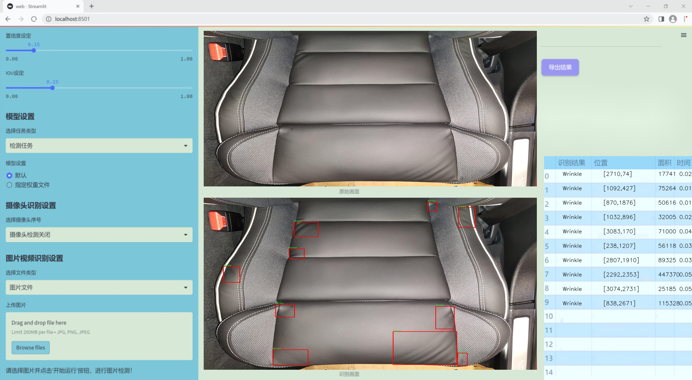
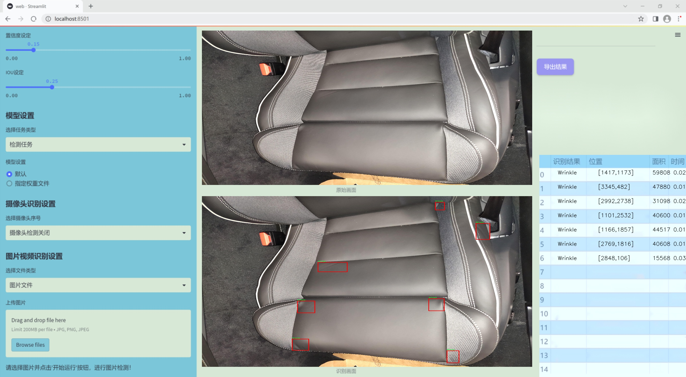
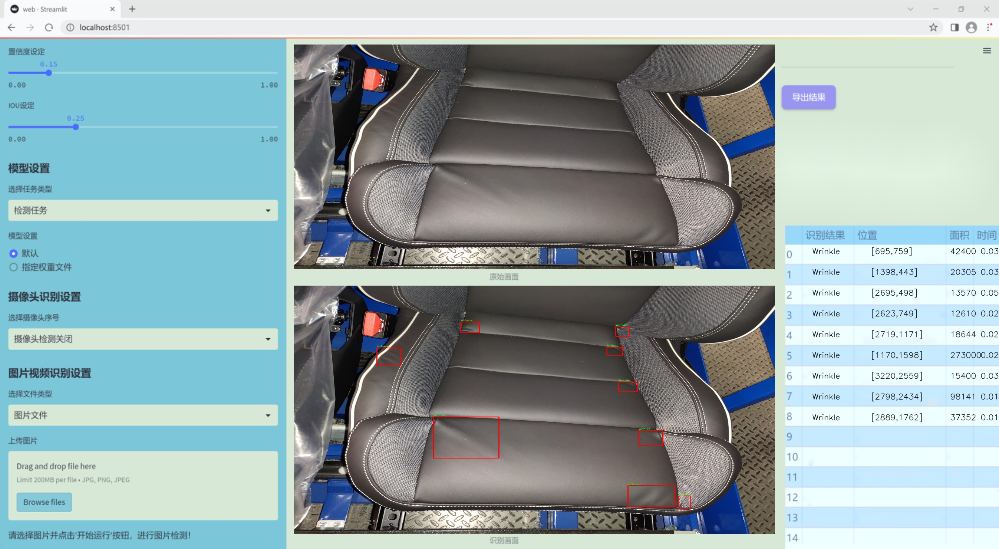
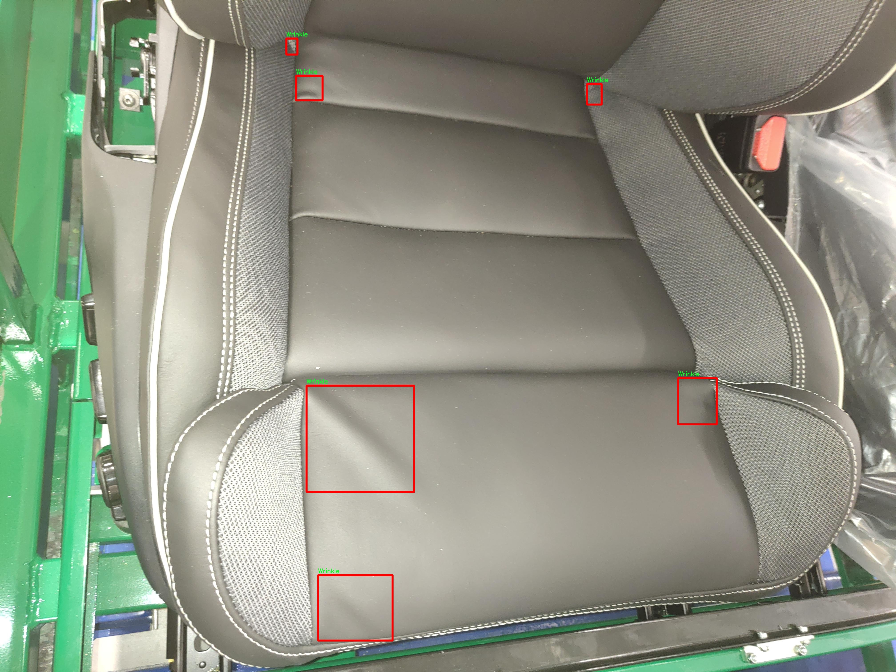
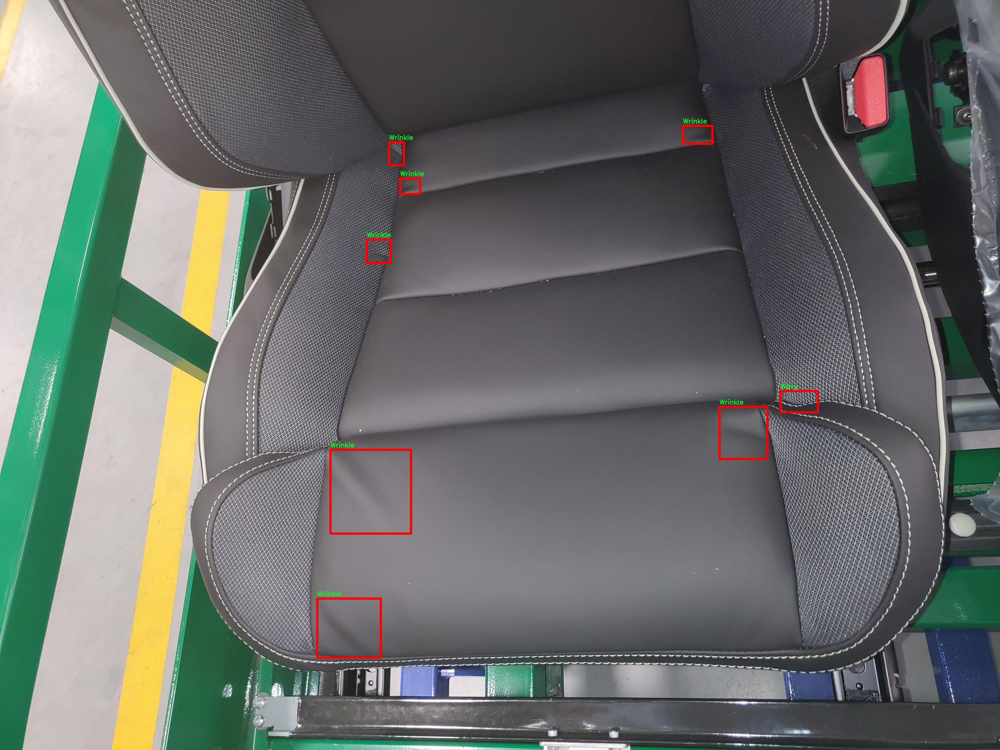
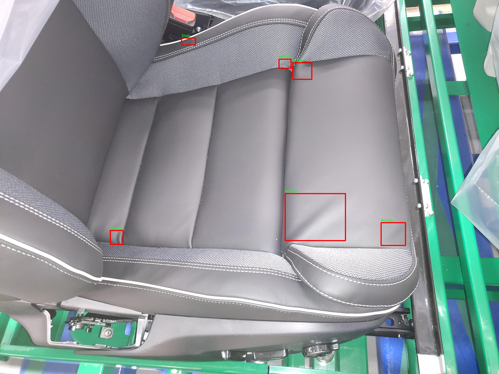
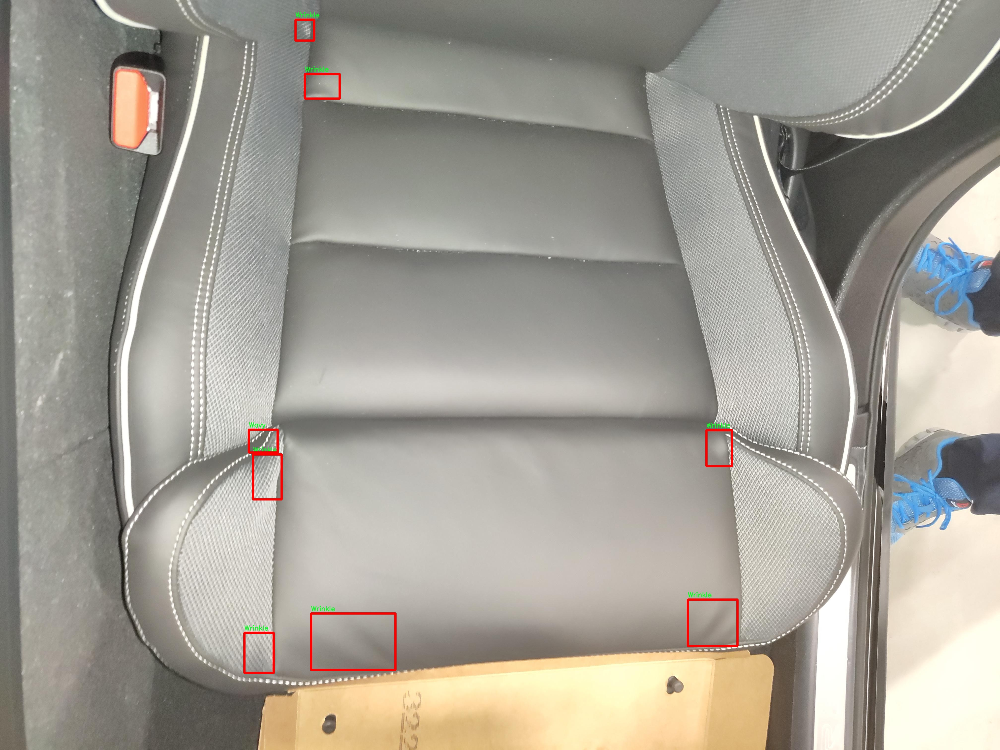
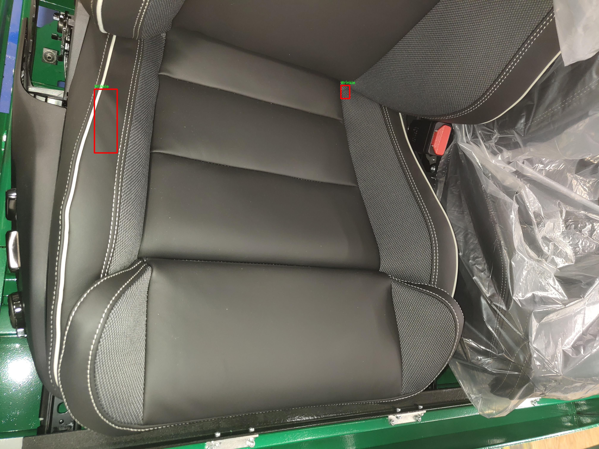

# 改进yolo11-DGCST等200+全套创新点大全：智慧质检儿童安全座椅表面缺陷检测系统源码＆数据集全套

### 1.图片效果展示







##### 项目来源 **[人工智能促进会 2024.10.24](https://kdocs.cn/l/cszuIiCKVNis)**

注意：由于项目一直在更新迭代，上面“1.图片效果展示”和“2.视频效果展示”展示的系统图片或者视频可能为老版本，新版本在老版本的基础上升级如下：（实际效果以升级的新版本为准）

  （1）适配了YOLOV11的“目标检测”模型和“实例分割”模型，通过加载相应的权重（.pt）文件即可自适应加载模型。

  （2）支持“图片识别”、“视频识别”、“摄像头实时识别”三种识别模式。

  （3）支持“图片识别”、“视频识别”、“摄像头实时识别”三种识别结果保存导出，解决手动导出（容易卡顿出现爆内存）存在的问题，识别完自动保存结果并导出到tempDir中。

  （4）支持Web前端系统中的标题、背景图等自定义修改。

  另外本项目提供训练的数据集和训练教程,暂不提供权重文件（best.pt）,需要您按照教程进行训练后实现图片演示和Web前端界面演示的效果。

### 2.视频效果展示

[2.1 视频效果展示](https://www.bilibili.com/video/BV17by2Y1EPp/)

### 3.背景

研究背景与意义

随着社会经济的发展和人们生活水平的提高，儿童安全座椅作为保障儿童乘车安全的重要设备，其市场需求逐年上升。然而，儿童安全座椅的生产过程中，表面缺陷问题却屡见不鲜，这不仅影响了产品的外观质量，更可能对儿童的安全造成潜在威胁。因此，建立一套高效、准确的表面缺陷检测系统显得尤为重要。传统的人工检测方法不仅耗时耗力，而且容易受到人为因素的影响，难以保证检测结果的准确性和一致性。基于此，利用先进的计算机视觉技术，尤其是深度学习中的目标检测算法，来实现自动化的缺陷检测，将成为提升儿童安全座椅质量控制的重要手段。

本研究基于改进的YOLOv11模型，旨在构建一个智慧质检系统，以实现对儿童安全座椅表面缺陷的自动检测。我们使用的数据集包含922张图像，涵盖了四种主要的缺陷类别：缝隙（Gap）、污渍（Stain）、波浪（Wavy）和皱纹（Wrinkle）。这些缺陷不仅在视觉上影响产品的美观，更可能影响其功能性和安全性。因此，针对这些缺陷进行有效的检测和分类，将有助于提升产品的整体质量，确保儿童在乘车过程中的安全。

通过改进YOLOv11模型，我们希望在提高检测精度和速度的同时，降低误检率和漏检率，从而为儿童安全座椅的生产企业提供一个高效、可靠的质检解决方案。此项研究不仅具有重要的理论意义，还有助于推动智能制造的发展，提升儿童安全座椅行业的整体竞争力，为消费者提供更为安全、优质的产品。

### 4.数据集信息展示

##### 4.1 本项目数据集详细数据（类别数＆类别名）

nc: 4
names: ['Gap', 'Stain', 'Wavy', 'Wrinkle']


该项目为【目标检测】数据集，请在【训练教程和Web端加载模型教程（第三步）】这一步的时候按照【目标检测】部分的教程来训练

##### 4.2 本项目数据集信息介绍

本项目数据集信息介绍

本项目所使用的数据集名为“ccc”，专门用于训练改进YOLOv11的智慧质检儿童安全座椅表面缺陷检测系统。该数据集包含四个主要类别，分别为“Gap”（缝隙）、“Stain”（污渍）、“Wavy”（波浪状）和“Wrinkle”（皱纹），这些类别涵盖了儿童安全座椅表面可能出现的主要缺陷类型。通过对这些缺陷的精准识别，系统能够有效提高儿童安全座椅的质量检测效率，从而确保产品在市场上的安全性和可靠性。

在数据集的构建过程中，研究团队对每个类别进行了细致的标注和分类，确保数据的准确性和代表性。数据集中的图像样本均为高分辨率，能够清晰地展示各种缺陷的特征。每个类别的样本数量经过精心设计，以保证模型在训练过程中能够充分学习到不同缺陷的特征，并在实际应用中具备良好的泛化能力。

此外，数据集还考虑到了不同光照条件和拍摄角度对缺陷识别的影响，涵盖了多种环境下的图像数据。这种多样性不仅提高了模型的鲁棒性，也使得系统在实际应用中能够适应不同的检测场景。通过使用“ccc”数据集，改进后的YOLOv11模型将能够更高效地识别儿童安全座椅表面的各种缺陷，从而为生产企业提供更为精准的质检方案，最终提升儿童安全座椅的整体安全标准和消费者的信任度。











### 5.全套项目环境部署视频教程（零基础手把手教学）

[5.1 所需软件PyCharm和Anaconda安装教程（第一步）](https://www.bilibili.com/video/BV1BoC1YCEKi/?spm_id_from=333.999.0.0&vd_source=bc9aec86d164b67a7004b996143742dc)


[5.2 安装Python虚拟环境创建和依赖库安装视频教程（第二步）](https://www.bilibili.com/video/BV1ZoC1YCEBw?spm_id_from=333.788.videopod.sections&vd_source=bc9aec86d164b67a7004b996143742dc)

### 6.改进YOLOv11训练教程和Web_UI前端加载模型教程（零基础手把手教学）

[6.1 改进YOLOv11训练教程和Web_UI前端加载模型教程（第三步）](https://www.bilibili.com/video/BV1BoC1YCEhR?spm_id_from=333.788.videopod.sections&vd_source=bc9aec86d164b67a7004b996143742dc)


按照上面的训练视频教程链接加载项目提供的数据集，运行train.py即可开始训练



     Epoch   gpu_mem       box       obj       cls    labels  img_size
     1/200     20.8G   0.01576   0.01955  0.007536        22      1280: 100%|██████████| 849/849 [14:42<00:00,  1.04s/it]
               Class     Images     Labels          P          R     mAP@.5 mAP@.5:.95: 100%|██████████| 213/213 [01:14<00:00,  2.87it/s]
                 all       3395      17314      0.994      0.957      0.0957      0.0843

     Epoch   gpu_mem       box       obj       cls    labels  img_size
     2/200     20.8G   0.01578   0.01923  0.007006        22      1280: 100%|██████████| 849/849 [14:44<00:00,  1.04s/it]
               Class     Images     Labels          P          R     mAP@.5 mAP@.5:.95: 100%|██████████| 213/213 [01:12<00:00,  2.95it/s]
                 all       3395      17314      0.996      0.956      0.0957      0.0845

     Epoch   gpu_mem       box       obj       cls    labels  img_size
     3/200     20.8G   0.01561    0.0191  0.006895        27      1280: 100%|██████████| 849/849 [10:56<00:00,  1.29it/s]
               Class     Images     Labels          P          R     mAP@.5 mAP@.5:.95: 100%|███████   | 187/213 [00:52<00:00,  4.04it/s]
                 all       3395      17314      0.996      0.957      0.0957      0.0845


###### [项目数据集下载链接](https://kdocs.cn/l/cszuIiCKVNis)

### 7.原始YOLOv11算法讲解

##### YOLO11简介

> YOLO11源码地址：https://github.com/ultralytics/ultralytics

Ultralytics
YOLO11是一款尖端的、最先进的模型，它在之前YOLO版本成功的基础上进行了构建，并引入了新功能和改进，以进一步提升性能和灵活性。YOLO11设计快速、准确且易于使用，使其成为各种物体检测和跟踪、实例分割、图像分类以及姿态估计任务的绝佳选择。  


**YOLO11创新点如下:**

YOLO 11主要改进包括：  
`增强的特征提取`：YOLO 11采用了改进的骨干和颈部架构，增强了特征提取功能，以实现更精确的目标检测。  
`优化的效率和速度`：优化的架构设计和优化的训练管道提供更快的处理速度，同时保持准确性和性能之间的平衡。  
`更高的精度，更少的参数`：YOLO11m在COCO数据集上实现了更高的平均精度（mAP），参数比YOLOv8m少22%，使其在不影响精度的情况下提高了计算效率。  
`跨环境的适应性`：YOLO 11可以部署在各种环境中，包括边缘设备、云平台和支持NVIDIA GPU的系统。  
`广泛的支持任务`：YOLO 11支持各种计算机视觉任务，如对象检测、实例分割、图像分类、姿态估计和面向对象检测（OBB）。

**YOLO11不同模型尺寸信息：**

YOLO11 提供5种不同的型号规模模型，以满足不同的应用需求：

Model| size (pixels)| mAPval 50-95| Speed CPU ONNX (ms)| Speed T4 TensorRT10
(ms)| params (M)| FLOPs (B)  
---|---|---|---|---|---|---  
YOLO11n| 640| 39.5| 56.1 ± 0.8| 1.5 ± 0.0| 2.6| 6.5  
YOLO11s| 640| 47.0| 90.0 ± 1.2| 2.5 ± 0.0| 9.4| 21.5  
YOLO11m| 640| 51.5| 183.2 ± 2.0| 4.7 ± 0.1| 20.1| 68.0  
YOLO11l| 640| 53.4| 238.6 ± 1.4| 6.2 ± 0.1| 25.3| 86.9  
YOLO11x| 640| 54.7| 462.8 ± 6.7| 11.3 ± 0.2| 56.9| 194.9  
  
**模型常用训练超参数参数说明：**  
`YOLOv11
模型的训练设置包括训练过程中使用的各种超参数和配置`。这些设置会影响模型的性能、速度和准确性。关键的训练设置包括批量大小、学习率、动量和权重衰减。此外，优化器、损失函数和训练数据集组成的选择也会影响训练过程。对这些设置进行仔细的调整和实验对于优化性能至关重要。  
**以下是一些常用的模型训练参数和说明：**

参数名| 默认值| 说明  
---|---|---  
`model`| `None`| 指定用于训练的模型文件。接受指向 `.pt` 预训练模型或 `.yaml`
配置文件。对于定义模型结构或初始化权重至关重要。  
`data`| `None`| 数据集配置文件的路径（例如
`coco8.yaml`).该文件包含特定于数据集的参数，包括训练数据和验证数据的路径、类名和类数。  
`epochs`| `100`| 训练总轮数。每个epoch代表对整个数据集进行一次完整的训练。调整该值会影响训练时间和模型性能。  
`patience`| `100`| 在验证指标没有改善的情况下，提前停止训练所需的epoch数。当性能趋于平稳时停止训练，有助于防止过度拟合。  
`batch`| `16`| 批量大小，有三种模式:设置为整数(例如，’ Batch =16 ‘)， 60% GPU内存利用率的自动模式(’ Batch
=-1 ‘)，或指定利用率分数的自动模式(’ Batch =0.70 ')。  
`imgsz`| `640`| 用于训练的目标图像尺寸。所有图像在输入模型前都会被调整到这一尺寸。影响模型精度和计算复杂度。  
`device`| `None`| 指定用于训练的计算设备：单个 GPU (`device=0`）、多个 GPU (`device=0,1`)、CPU
(`device=cpu`)，或苹果芯片的 MPS (`device=mps`).  
`workers`| `8`| 加载数据的工作线程数（每 `RANK` 多 GPU 训练）。影响数据预处理和输入模型的速度，尤其适用于多 GPU 设置。  
`name`| `None`| 训练运行的名称。用于在项目文件夹内创建一个子目录，用于存储训练日志和输出结果。  
`pretrained`| `True`| 决定是否从预处理模型开始训练。可以是布尔值，也可以是加载权重的特定模型的字符串路径。提高训练效率和模型性能。  
`optimizer`| `'auto'`| 为训练模型选择优化器。选项包括 `SGD`, `Adam`, `AdamW`, `NAdam`,
`RAdam`, `RMSProp` 等，或 `auto` 用于根据模型配置进行自动选择。影响收敛速度和稳定性  
`lr0`| `0.01`| 初始学习率（即 `SGD=1E-2`, `Adam=1E-3`) .调整这个值对优化过程至关重要，会影响模型权重的更新速度。  
`lrf`| `0.01`| 最终学习率占初始学习率的百分比 = (`lr0 * lrf`)，与调度程序结合使用，随着时间的推移调整学习率。  


**各损失函数作用说明：**  
`定位损失box_loss`：预测框与标定框之间的误差（GIoU），越小定位得越准；  
`分类损失cls_loss`：计算锚框与对应的标定分类是否正确，越小分类得越准；  
`动态特征损失（dfl_loss）`：DFLLoss是一种用于回归预测框与目标框之间距离的损失函数。在计算损失时，目标框需要缩放到特征图尺度，即除以相应的stride，并与预测的边界框计算Ciou
Loss，同时与预测的anchors中心点到各边的距离计算回归DFLLoss。  


### 8.200+种全套改进YOLOV11创新点原理讲解

#### 8.1 200+种全套改进YOLOV11创新点原理讲解大全

由于篇幅限制，每个创新点的具体原理讲解就不全部展开，具体见下列网址中的改进模块对应项目的技术原理博客网址【Blog】（创新点均为模块化搭建，原理适配YOLOv5~YOLOv11等各种版本）

[改进模块技术原理博客【Blog】网址链接](https://gitee.com/qunmasj/good)


#### 8.2 精选部分改进YOLOV11创新点原理讲解

###### 这里节选部分改进创新点展开原理讲解(完整的改进原理见上图和[改进模块技术原理博客链接](https://gitee.com/qunmasj/good)【如果此小节的图加载失败可以通过CSDN或者Github搜索该博客的标题访问原始博客，原始博客图片显示正常】

### Gold-YOLO


#### Preliminaries
YOLO系列的中间层结构采用了传统的FPN结构，其中包含多个分支用于多尺度特征融合。然而，它只充分融合来自相邻级别的特征，对于其他层次的信息只能间接地进行“递归”获取。

传统的FPN结构在信息传输过程中存在丢失大量信息的问题。这是因为层之间的信息交互仅限于中间层选择的信息，未被选择的信息在传输过程中被丢弃。这种情况导致某个Level的信息只能充分辅助相邻层，而对其他全局层的帮助较弱。因此，整体上信息融合的有效性可能受到限制。
为了避免在传输过程中丢失信息，本文采用了一种新颖的“聚集和分发”机制（GD），放弃了原始的递归方法。该机制使用一个统一的模块来收集和融合所有Level的信息，并将其分发到不同的Level。通过这种方式，作者不仅避免了传统FPN结构固有的信息丢失问题，还增强了中间层的部分信息融合能力，而且并没有显著增加延迟。


#### 低阶聚合和分发分支 Low-stage gather-and-distribute branch
从主干网络中选择输出的B2、B3、B4、B5特征进行融合，以获取保留小目标信息的高分辨率特征。


#### 高阶聚合和分发分支 High-stage gather-and-distribute branch
高级全局特征对齐模块（High-GD）将由低级全局特征对齐模块（Low-GD）生成的特征{P3, P4, P5}进行融合。


Transformer融合模块由多个堆叠的transformer组成，transformer块的数量为L。每个transformer块包括一个多头注意力块、一个前馈网络（FFN）和残差连接。采用与LeViT相同的设置来配置多头注意力块，使用16个通道作为键K和查询Q的头维度，32个通道作为值V的头维度。为了加速推理过程，将层归一化操作替换为批归一化，并将所有的GELU激活函数替换为ReLU。为了增强变换器块的局部连接，在两个1x1卷积层之间添加了一个深度卷积层。同时，将FFN的扩展因子设置为2，以在速度和计算成本之间取得平衡。


信息注入模块(Information injection module)： 高级全局特征对齐模块（High-GD）中的信息注入模块与低级全局特征对齐模块（Low-GD）中的相同。在高级阶段，局部特征（Flocal）等于Pi，因此公式如下所示：


#### 增强的跨层信息流动 Enhanced cross-layer information flow
为了进一步提升性能，从YOLOv6 中的PAFPN模块中得到启发，引入了Inject-LAF模块。该模块是注入模块的增强版，包括了一个轻量级相邻层融合（LAF）模块，该模块被添加到注入模块的输入位置。为了在速度和准确性之间取得平衡，设计了两个LAF模型：LAF低级模型和LAF高级模型，分别用于低级注入（合并相邻两层的特征）和高级注入（合并相邻一层的特征）。它们的结构如图5(b)所示。为了确保来自不同层级的特征图与目标大小对齐，在实现中的两个LAF模型仅使用了三个操作符：双线性插值（上采样过小的特征）、平均池化（下采样过大的特征）和1x1卷积（调整与目标通道不同的特征）。模型中的LAF模块与信息注入模块的结合有效地平衡了准确性和速度之间的关系。通过使用简化的操作，能够增加不同层级之间的信息流路径数量，从而提高性能而不显著增加延迟。


### 9.系统功能展示

图9.1.系统支持检测结果表格显示

  图9.2.系统支持置信度和IOU阈值手动调节

  图9.3.系统支持自定义加载权重文件best.pt(需要你通过步骤5中训练获得)

  图9.4.系统支持摄像头实时识别

  图9.5.系统支持图片识别

  图9.6.系统支持视频识别

  图9.7.系统支持识别结果文件自动保存

  图9.8.系统支持Excel导出检测结果数据


### 10. YOLOv11核心改进源码讲解

#### 10.1 test_selective_scan_easy.py

以下是对您提供的代码的核心部分进行的分析和注释。代码主要实现了一个选择性扫描（Selective Scan）操作，常用于处理序列数据。代码中涉及的主要功能包括前向传播和反向传播。

```python
import torch
import torch.nn.functional as F

def selective_scan_easy(us, dts, As, Bs, Cs, Ds, delta_bias=None, delta_softplus=False, return_last_state=False, chunksize=64):
    """
    选择性扫描函数
    参数:
    us: 输入张量，形状为 (B, G * D, L)
    dts: 时间增量张量，形状为 (B, G * D, L)
    As: 矩阵 A，形状为 (G * D, N)
    Bs: 矩阵 B，形状为 (B, G, N, L)
    Cs: 矩阵 C，形状为 (B, G, N, L)
    Ds: 矩阵 D，形状为 (G * D)
    delta_bias: 可选的偏置，形状为 (G * D)
    delta_softplus: 是否应用 softplus 激活
    return_last_state: 是否返回最后的状态
    chunksize: 每次处理的序列长度
    """
    
    def selective_scan_chunk(us, dts, As, Bs, Cs, hprefix):
        """
        处理一个块的选择性扫描
        参数:
        us: 输入张量
        dts: 时间增量张量
        As, Bs, Cs: 矩阵
        hprefix: 前一个状态
        返回:
        ys: 输出张量
        hs: 状态张量
        """
        ts = dts.cumsum(dim=0)  # 计算时间增量的累积和
        Ats = torch.einsum("gdn,lbgd->lbgdn", As, ts).exp()  # 计算 A 的指数
        rAts = Ats  # 归一化 A
        duts = dts * us  # 计算 duts
        dtBus = torch.einsum("lbgd,lbgn->lbgdn", duts, Bs)  # 计算 dtBus
        hs_tmp = rAts * (dtBus / rAts).cumsum(dim=0)  # 计算状态
        hs = hs_tmp + Ats * hprefix.unsqueeze(0)  # 更新状态
        ys = torch.einsum("lbgn,lbgdn->lbgd", Cs, hs)  # 计算输出
        return ys, hs

    # 数据类型处理
    dtype = torch.float32
    inp_dtype = us.dtype
    has_D = Ds is not None
    if chunksize < 1:
        chunksize = Bs.shape[-1]

    dts = dts.to(dtype)  # 转换数据类型
    if delta_bias is not None:
        dts = dts + delta_bias.view(1, -1, 1).to(dtype)  # 添加偏置
    if delta_softplus:
        dts = F.softplus(dts)  # 应用 softplus 激活

    # 数据维度调整
    Bs = Bs.unsqueeze(1) if len(Bs.shape) == 3 else Bs
    Cs = Cs.unsqueeze(1) if len(Cs.shape) == 3 else Cs
    B, G, N, L = Bs.shape
    us = us.view(B, G, -1, L).permute(3, 0, 1, 2).to(dtype)
    dts = dts.view(B, G, -1, L).permute(3, 0, 1, 2).to(dtype)
    As = As.view(G, -1, N).to(dtype)
    Bs = Bs.permute(3, 0, 1, 2).to(dtype)
    Cs = Cs.permute(3, 0, 1, 2).to(dtype)
    Ds = Ds.view(G, -1).to(dtype) if has_D else None

    oys = []  # 输出集合
    hprefix = us.new_zeros((B, G, D, N), dtype=dtype)  # 初始化状态
    for i in range(0, L, chunksize):
        ys, hs = selective_scan_chunk(
            us[i:i + chunksize], dts[i:i + chunksize], 
            As, Bs[i:i + chunksize], Cs[i:i + chunksize], hprefix
        )
        oys.append(ys)  # 收集输出
        hprefix = hs[-1]  # 更新前一个状态

    oys = torch.cat(oys, dim=0)  # 合并输出
    if has_D:
        oys = oys + Ds * us  # 添加 D 的影响
    oys = oys.permute(1, 2, 3, 0).view(B, -1, L)  # 调整输出形状

    return oys.to(inp_dtype) if not return_last_state else (oys.to(inp_dtype), hprefix.view(B, G * D, N).float())
```

### 代码核心部分分析
1. **选择性扫描函数**：`selective_scan_easy` 是主函数，负责执行选择性扫描操作。
2. **块处理**：`selective_scan_chunk` 函数处理输入的一个块，计算状态和输出。
3. **时间增量处理**：通过 `cumsum` 计算时间增量的累积和，确保序列数据的顺序性。
4. **矩阵运算**：使用 `torch.einsum` 进行高效的矩阵运算，减少内存占用和计算时间。
5. **状态更新**：通过前一个状态和当前输入更新当前状态，确保状态的连续性。
6. **返回值**：根据参数决定是否返回最后的状态，便于后续的计算。

### 总结
这段代码实现了一个高效的选择性扫描机制，适用于处理序列数据，特别是在深度学习模型中。通过合理的矩阵运算和状态管理，能够在保证计算效率的同时，保持数据的完整性和准确性。

这个文件 `test_selective_scan_easy.py` 是一个用于测试选择性扫描（Selective Scan）算法的 Python 脚本，主要使用 PyTorch 框架进行深度学习相关的计算。代码中实现了选择性扫描的前向和反向传播过程，并且包含了多种测试用例来验证算法的正确性。

首先，文件引入了一些必要的库，包括 `math`、`torch`、`torch.nn.functional`、`pytest` 和 `einops`。这些库提供了数学计算、张量操作、自动求导和测试功能。

接下来，定义了一个 `selective_scan_easy` 函数，该函数实现了选择性扫描的核心逻辑。该函数接受多个参数，包括输入张量 `us`、时间差 `dts`、以及一些权重矩阵 `As`、`Bs`、`Cs` 和 `Ds`。函数内部定义了一个 `selective_scan_chunk` 的嵌套函数，用于处理数据块的选择性扫描。

在 `selective_scan_easy` 函数中，首先对输入数据进行类型转换和形状调整，以确保数据符合后续计算的要求。然后，函数通过循环处理输入序列的每个块，计算输出张量 `oys` 和状态张量 `hprefix`。最后，函数返回计算结果，支持返回最后的状态。

接着，定义了一个 `SelectiveScanEasy` 类，继承自 `torch.autograd.Function`，用于实现自定义的前向和反向传播逻辑。该类的 `forward` 方法实现了选择性扫描的前向计算，而 `backward` 方法则实现了反向传播的梯度计算。反向传播过程中，使用了保存的中间张量来计算各个输入的梯度。

文件中还定义了多个版本的选择性扫描函数，如 `selective_scan_easyv2` 和 `selective_scan_easyv3`，这些版本在实现上可能有细微的差别，旨在优化性能或支持不同的功能。

最后，文件使用 `pytest` 框架定义了一系列测试用例，确保选择性扫描的实现能够正确处理不同的输入配置。这些测试用例涵盖了不同的数据类型、序列长度、是否包含偏置等多种情况，通过比较输出结果和参考实现的结果来验证算法的正确性。

总的来说，这个文件实现了选择性扫描算法的核心逻辑，并通过一系列测试用例来确保其功能的正确性和稳定性。

#### 10.2 block.py

以下是代码中最核心的部分，并附上详细的中文注释：

```python
import torch
import torch.nn as nn
import torch.nn.functional as F

def autopad(k, p=None, d=1):  # kernel, padding, dilation
    """自动填充以保持输出形状相同。"""
    if d > 1:
        k = d * (k - 1) + 1 if isinstance(k, int) else [d * (x - 1) + 1 for x in k]  # 实际的卷积核大小
    if p is None:
        p = k // 2 if isinstance(k, int) else [x // 2 for x in k]  # 自动填充
    return p

class Conv(nn.Module):
    """自定义卷积层，包含卷积和批归一化。"""
    def __init__(self, in_channels, out_channels, kernel_size=3, stride=1, padding=None, groups=1, act=True):
        super().__init__()
        self.conv = nn.Conv2d(in_channels, out_channels, kernel_size, stride, autopad(kernel_size, padding), groups=groups, bias=False)
        self.bn = nn.BatchNorm2d(out_channels)
        self.act = nn.SiLU() if act else nn.Identity()  # 使用SiLU激活函数

    def forward(self, x):
        """前向传播函数。"""
        return self.act(self.bn(self.conv(x)))

class Bottleneck(nn.Module):
    """标准瓶颈结构，包含两个卷积层。"""
    def __init__(self, c1, c2, shortcut=True, g=1, k=(3, 3), e=0.5):
        super().__init__()
        c_ = int(c2 * e)  # 隐藏通道数
        self.cv1 = Conv(c1, c_, k[0], 1)  # 第一个卷积层
        self.cv2 = Conv(c_, c2, k[1], 1, g=g)  # 第二个卷积层
        self.add = shortcut and c1 == c2  # 是否使用shortcut连接

    def forward(self, x):
        """前向传播函数。"""
        return x + self.cv2(self.cv1(x)) if self.add else self.cv2(self.cv1(x))

class C3k(nn.Module):
    """C3k模块，包含多个瓶颈结构。"""
    def __init__(self, c1, c2, n=1, shortcut=False, g=1, e=0.5, k=3):
        super().__init__()
        self.m = nn.Sequential(*(Bottleneck(c1, c2, shortcut, g, k=(k, k), e=e) for _ in range(n)))  # 创建n个瓶颈结构

    def forward(self, x):
        """前向传播函数。"""
        return self.m(x)

class DynamicConv(nn.Module):
    """动态卷积层，使用条件卷积。"""
    def __init__(self, c1, c2, k=1, s=1, p=None, g=1, d=1, act=True, num_experts=4):
        super().__init__()
        self.conv = nn.Sequential(
            DynamicConv_Single(c1, c2, kernel_size=k, stride=s, padding=autopad(k, p, d), dilation=d, groups=g, num_experts=num_experts),
            nn.BatchNorm2d(c2),
            nn.SiLU() if act else nn.Identity()
        )

    def forward(self, x):
        """前向传播函数。"""
        return self.conv(x)

class FocusFeature(nn.Module):
    """聚焦特征模块，融合多种特征。"""
    def __init__(self, inc, kernel_sizes=(5, 7, 9, 11), e=0.5):
        super().__init__()
        hidc = int(inc[1] * e)  # 隐藏通道数
        
        self.conv1 = nn.Sequential(
            nn.Upsample(scale_factor=2),
            Conv(inc[0], hidc, 1)
        )
        self.conv2 = Conv(inc[1], hidc, 1) if e != 1 else nn.Identity()
        self.conv3 = ADown(inc[2], hidc)  # 进行下采样
        
        self.dw_conv = nn.ModuleList(nn.Conv2d(hidc * 3, hidc * 3, kernel_size=k, padding=autopad(k), groups=hidc * 3) for k in kernel_sizes)
        self.pw_conv = Conv(hidc * 3, hidc * 3)

    def forward(self, x):
        """前向传播函数。"""
        x1, x2, x3 = x
        x1 = self.conv1(x1)
        x2 = self.conv2(x2)
        x3 = self.conv3(x3)
        
        x = torch.cat([x1, x2, x3], dim=1)  # 连接特征
        feature = torch.sum(torch.stack([x] + [layer(x) for layer in self.dw_conv], dim=0), dim=0)
        feature = self.pw_conv(feature)  # 进行特征融合
        
        x = x + feature  # 残差连接
        return x

# 其他类的定义省略，以上是核心部分的示例。
```

在这段代码中，保留了最核心的类和函数，并对其进行了详细的中文注释，解释了每个类和函数的作用及其前向传播的逻辑。

这个程序文件 `block.py` 包含了多种深度学习模块的实现，主要用于构建神经网络中的不同层和块，特别是在计算机视觉任务中。以下是对文件中主要内容的说明：

首先，文件引入了许多必要的库和模块，包括 PyTorch、NumPy、以及一些自定义的模块，如卷积层、注意力机制、动态卷积等。文件的开头定义了一些通用的函数和类，例如 `autopad` 用于自动计算卷积的填充。

接下来，文件定义了多个神经网络块的类。每个类代表一个特定的功能模块，例如：

- **DyHeadBlock** 和 **DyHeadBlockWithDCNV3**：这些类实现了动态头部模块，使用了可调节的卷积和注意力机制，以增强特征提取能力。
- **Fusion**：实现了特征融合的功能，可以将多个输入特征图进行加权或拼接。
- **Partial_conv3** 和 **Faster_Block**：这些类实现了特定的卷积块，结合了不同的卷积策略和激活函数。
- **ContextGuidedBlock** 和 **ContextGuideFusionModule**：这些模块利用上下文信息来增强特征图，适用于图像分割和目标检测等任务。
- **CSPStage**：实现了 CSP（Cross Stage Partial）结构，常用于高效的特征提取。
- **RepViTBlock** 和 **UniRepLKNetBlock**：这些类实现了基于视觉变换器的块，结合了卷积和自注意力机制。
- **C3k2** 和 **C3**：这些类实现了网络的基本结构，通常用于构建更复杂的网络架构。

文件中还实现了一些新颖的模块，如 **MogaBlock** 和 **SMAFormerBlock**，这些模块结合了多种注意力机制和卷积策略，以提高模型的性能。

此外，文件还包含了一些用于特征融合和上下文增强的模块，如 **SDI** 和 **CAFM**，这些模块通过自适应的方式结合不同层次的特征，提升了模型的表现。

最后，文件定义了一些与 YOLO 系列模型相关的模块，如 **DCNv4** 和 **RepConv**，这些模块专门针对目标检测任务进行了优化。

总体而言，`block.py` 文件提供了一个丰富的模块库，可以用于构建各种计算机视觉模型，尤其是基于卷积和注意力机制的深度学习模型。

#### 10.3 pkinet.py

以下是代码中最核心的部分，并附上详细的中文注释：

```python
import math
import torch
import torch.nn as nn

class DropPath(nn.Module):
    """实现随机深度（Drop Path）机制的模块。
    
    随机深度是一种正则化技术，可以在训练过程中随机丢弃某些路径，从而减少过拟合。
    
    Args:
        drop_prob (float): 路径被丢弃的概率。默认值为0.1。
    """

    def __init__(self, drop_prob: float = 0.1):
        super().__init__()
        self.drop_prob = drop_prob  # 保存丢弃概率

    def forward(self, x: torch.Tensor) -> torch.Tensor:
        """前向传播，应用随机深度机制。
        
        Args:
            x (torch.Tensor): 输入张量。
        
        Returns:
            torch.Tensor: 经过随机深度处理后的输出张量。
        """
        if self.drop_prob == 0. or not self.training:  # 如果丢弃概率为0或不在训练模式下，直接返回输入
            return x
        keep_prob = 1 - self.drop_prob  # 计算保留概率
        shape = (x.shape[0], ) + (1, ) * (x.ndim - 1)  # 处理不同维度的张量
        random_tensor = keep_prob + torch.rand(shape, dtype=x.dtype, device=x.device)  # 生成随机张量
        output = x.div(keep_prob) * random_tensor.floor()  # 应用丢弃
        return output

class ConvFFN(BaseModule):
    """使用卷积模块实现的多层感知机（Feed Forward Network）。
    
    Args:
        in_channels (int): 输入通道数。
        out_channels (Optional[int]): 输出通道数。如果为None，则与输入通道数相同。
        hidden_channels_scale (float): 隐藏层通道数的缩放因子。默认值为4.0。
        dropout_rate (float): Dropout的比率。默认值为0.。
        add_identity (bool): 是否添加身份映射。默认值为True。
    """

    def __init__(self, in_channels: int, out_channels: Optional[int] = None,
                 hidden_channels_scale: float = 4.0, dropout_rate: float = 0.,
                 add_identity: bool = True, norm_cfg: Optional[dict] = None,
                 act_cfg: Optional[dict] = None):
        super().__init__()
        out_channels = out_channels or in_channels  # 如果没有指定输出通道数，则与输入通道数相同
        hidden_channels = int(in_channels * hidden_channels_scale)  # 计算隐藏层通道数

        # 定义前向传播的层
        self.ffn_layers = nn.Sequential(
            nn.LayerNorm(in_channels),  # 归一化层
            ConvModule(in_channels, hidden_channels, kernel_size=1, stride=1, padding=0,
                       norm_cfg=norm_cfg, act_cfg=act_cfg),  # 1x1卷积
            ConvModule(hidden_channels, hidden_channels, kernel_size=3, stride=1, padding=1,
                       groups=hidden_channels, norm_cfg=norm_cfg, act_cfg=None),  # 深度卷积
            nn.GELU(),  # 激活函数
            nn.Dropout(dropout_rate),  # Dropout层
            ConvModule(hidden_channels, out_channels, kernel_size=1, stride=1, padding=0,
                       norm_cfg=norm_cfg, act_cfg=act_cfg),  # 1x1卷积
            nn.Dropout(dropout_rate),  # Dropout层
        )
        self.add_identity = add_identity  # 是否添加身份映射

    def forward(self, x):
        """前向传播。
        
        Args:
            x (torch.Tensor): 输入张量。
        
        Returns:
            torch.Tensor: 输出张量。
        """
        x = x + self.ffn_layers(x) if self.add_identity else self.ffn_layers(x)  # 如果需要身份映射，则添加
        return x

class PKINet(BaseModule):
    """多核卷积网络（Poly Kernel Inception Network）。
    
    Args:
        arch (str): 网络架构类型，'T', 'S', 'B'。
        out_indices (Sequence[int]): 输出的层索引。
        drop_path_rate (float): 随机深度的比率。
    """

    def __init__(self, arch: str = 'S', out_indices: Sequence[int] = (0, 1, 2, 3, 4),
                 drop_path_rate: float = 0.1):
        super().__init__()
        self.out_indices = out_indices  # 保存输出层索引
        self.stages = nn.ModuleList()  # 初始化网络阶段列表

        # 根据指定的架构类型初始化网络
        self.stem = Stem(3, arch_setting[0][0])  # 初始化Stem层
        self.stages.append(self.stem)  # 添加Stem层到阶段列表

        # 依次添加各个阶段
        for i, (in_channels, out_channels, num_blocks, kernel_sizes, dilations, expansion) in enumerate(arch_setting):
            stage = PKIStage(in_channels, out_channels, num_blocks, kernel_sizes, dilations, expansion)
            self.stages.append(stage)  # 添加阶段到列表

    def forward(self, x):
        """前向传播。
        
        Args:
            x (torch.Tensor): 输入张量。
        
        Returns:
            tuple: 输出张量的元组。
        """
        outs = []  # 初始化输出列表
        for i, stage in enumerate(self.stages):
            x = stage(x)  # 通过每个阶段处理输入
            if i in self.out_indices:
                outs.append(x)  # 如果当前阶段在输出索引中，则保存输出
        return tuple(outs)  # 返回输出元组

# 构建不同架构的网络实例
def PKINET_T():
    return PKINet('T')

def PKINET_S():
    return PKINet('S')

def PKINET_B():
    return PKINet('B')
```

### 代码核心部分解释：
1. **DropPath**: 实现了随机深度的机制，通过丢弃部分路径来增强模型的泛化能力。
2. **ConvFFN**: 通过卷积层构建的前馈神经网络，包含多个卷积层和激活函数，支持身份映射。
3. **PKINet**: 多核卷积网络的主类，负责构建网络的不同阶段，并进行前向传播。

这些类和方法是实现多核卷积网络的基础，负责网络的结构和前向计算。

这个程序文件 `pkinet.py` 实现了一个名为 PKINet 的深度学习模型，主要用于计算机视觉任务。该模型的结构基于多种卷积和注意力机制，旨在提高图像处理的效果。以下是对文件中各个部分的详细说明。

首先，程序导入了必要的库，包括 `math`、`torch` 和 `torch.nn`，并尝试从其他模块中导入一些特定的功能，如卷积模块和权重初始化方法。如果导入失败，则使用默认的 PyTorch 模块。

接下来，定义了一些工具函数和类。例如，`drop_path` 函数实现了随机深度（Stochastic Depth）机制，通过随机丢弃路径来提高模型的泛化能力。`DropPath` 类是对该函数的封装，方便在模型中使用。

`autopad` 函数用于自动计算卷积的填充，以确保输出的空间维度与输入一致。`make_divisible` 函数确保通道数是可被指定值整除的，以满足特定的模型设计要求。

接下来的几个类（如 `BCHW2BHWC` 和 `BHWC2BCHW`）用于在不同的张量维度之间进行转换，适应不同操作的输入要求。`GSiLU` 类实现了一种新的激活函数，结合了全局平均池化和 Sigmoid 函数。

`CAA` 类实现了上下文锚点注意力机制，增强了模型对上下文信息的捕捉能力。`ConvFFN` 类则实现了一个多层感知机，使用卷积模块构建，能够处理特征的转换。

`Stem` 和 `DownSamplingLayer` 类分别用于构建模型的初始层和下采样层，确保特征图的尺寸适合后续处理。`InceptionBottleneck` 类实现了一个瓶颈结构，结合了多个卷积操作以提取多尺度特征。

`PKIBlock` 类是多核 Inception 模块的实现，集成了之前定义的组件，并通过可选的层缩放和身份连接增强了模型的表现。`PKIStage` 类则由多个 `PKIBlock` 组成，形成模型的一个阶段。

最后，`PKINet` 类是整个模型的核心，定义了网络的架构和前向传播逻辑。它包含多个阶段，并通过参数配置不同的网络结构。模型的初始化权重也在这里进行设置。

在文件的最后部分，定义了三个函数 `PKINET_T`、`PKINET_S` 和 `PKINET_B`，分别返回不同规模的 PKINet 模型。主程序部分创建了一个 PKINET_T 模型实例，并对随机输入进行前向传播，输出各层的特征图尺寸。

总体而言，该文件实现了一个复杂的深度学习模型，采用了多种先进的技术和结构，旨在提高计算机视觉任务的性能。

#### 10.4 rmt.py

以下是经过简化和注释的核心代码部分，保留了主要的类和方法，并对其进行了详细的中文注释：

```python
import torch
import torch.nn as nn
import torch.nn.functional as F

class DWConv2d(nn.Module):
    """ 深度可分离卷积层 """
    def __init__(self, dim, kernel_size, stride, padding):
        super().__init__()
        # 使用 groups=dim 实现深度可分离卷积
        self.conv = nn.Conv2d(dim, dim, kernel_size, stride, padding, groups=dim)

    def forward(self, x: torch.Tensor):
        ''' 
        前向传播
        x: 输入张量，形状为 (b, h, w, c)
        '''
        x = x.permute(0, 3, 1, 2)  # 转换为 (b, c, h, w)
        x = self.conv(x)  # 卷积操作
        x = x.permute(0, 2, 3, 1)  # 转换回 (b, h, w, c)
        return x

class MaSA(nn.Module):
    """ 多头自注意力机制 """
    def __init__(self, embed_dim, num_heads, value_factor=1):
        super().__init__()
        self.factor = value_factor
        self.embed_dim = embed_dim
        self.num_heads = num_heads
        self.head_dim = self.embed_dim * self.factor // num_heads
        self.key_dim = self.embed_dim // num_heads
        self.scaling = self.key_dim ** -0.5
        
        # 线性变换用于生成查询、键、值
        self.q_proj = nn.Linear(embed_dim, embed_dim, bias=True)
        self.k_proj = nn.Linear(embed_dim, embed_dim, bias=True)
        self.v_proj = nn.Linear(embed_dim, embed_dim * self.factor, bias=True)
        self.lepe = DWConv2d(embed_dim, 5, 1, 2)  # 深度可分离卷积用于位置编码
        self.out_proj = nn.Linear(embed_dim * self.factor, embed_dim, bias=True)

    def forward(self, x: torch.Tensor, rel_pos):
        '''
        前向传播
        x: 输入张量，形状为 (b, h, w, c)
        rel_pos: 位置关系矩阵
        '''
        bsz, h, w, _ = x.size()
        q = self.q_proj(x)  # 查询
        k = self.k_proj(x)  # 键
        v = self.v_proj(x)  # 值
        lepe = self.lepe(v)  # 位置编码

        k *= self.scaling  # 缩放键
        # 计算注意力矩阵
        qk_mat = (q @ k.transpose(-1, -2)) + rel_pos  # 加上位置关系
        qk_mat = torch.softmax(qk_mat, -1)  # softmax归一化
        output = torch.matmul(qk_mat, v)  # 计算输出

        output = output + lepe  # 加上位置编码
        output = self.out_proj(output)  # 最终线性变换
        return output

class FeedForwardNetwork(nn.Module):
    """ 前馈神经网络 """
    def __init__(self, embed_dim, ffn_dim, activation_fn=F.gelu, dropout=0.0):
        super().__init__()
        self.fc1 = nn.Linear(embed_dim, ffn_dim)  # 第一层线性变换
        self.fc2 = nn.Linear(ffn_dim, embed_dim)  # 第二层线性变换
        self.dropout = nn.Dropout(dropout)  # dropout层
        self.activation_fn = activation_fn  # 激活函数

    def forward(self, x: torch.Tensor):
        ''' 
        前向传播
        x: 输入张量，形状为 (b, h, w, c)
        '''
        x = self.fc1(x)  # 第一层
        x = self.activation_fn(x)  # 激活
        x = self.dropout(x)  # dropout
        x = self.fc2(x)  # 第二层
        return x

class VisRetNet(nn.Module):
    """ 视觉回归网络 """
    def __init__(self, in_chans=3, num_classes=1000, embed_dims=[96, 192, 384, 768], depths=[2, 2, 6, 2], num_heads=[3, 6, 12, 24]):
        super().__init__()
        self.patch_embed = PatchEmbed(in_chans=in_chans, embed_dim=embed_dims[0])  # 图像分块嵌入
        self.layers = nn.ModuleList()  # 存储网络层
        for i_layer in range(len(depths)):
            layer = BasicLayer(embed_dim=embed_dims[i_layer], depth=depths[i_layer], num_heads=num_heads[i_layer])
            self.layers.append(layer)

    def forward(self, x):
        ''' 
        前向传播
        x: 输入张量，形状为 (b, c, h, w)
        '''
        x = self.patch_embed(x)  # 图像分块嵌入
        for layer in self.layers:
            x = layer(x)  # 逐层前向传播
        return x

# 定义模型的构造函数
def RMT_T():
    model = VisRetNet(
        embed_dims=[64, 128, 256, 512],
        depths=[2, 2, 8, 2],
        num_heads=[4, 4, 8, 16]
    )
    return model

if __name__ == '__main__':
    model = RMT_T()  # 创建模型实例
    inputs = torch.randn((1, 3, 640, 640))  # 随机输入
    res = model(inputs)  # 前向传播
    print(res.size())  # 输出结果的形状
```

### 代码说明：
1. **DWConv2d**: 实现了深度可分离卷积，适用于减少模型参数和计算量。
2. **MaSA**: 实现了多头自注意力机制，能够处理输入特征的上下文信息。
3. **FeedForwardNetwork**: 前馈神经网络，用于特征的非线性变换。
4. **VisRetNet**: 视觉回归网络的主要结构，包含图像分块嵌入和多个层。
5. **RMT_T**: 定义了一个模型构造函数，返回一个特定配置的视觉回归网络。

这些核心部分构成了一个视觉模型的基础，能够进行图像特征提取和处理。

这个程序文件 `rmt.py` 实现了一个视觉变换器（Vision Transformer）模型，名为 `VisRetNet`，并提供了不同规模的模型构造函数（如 `RMT_T`, `RMT_S`, `RMT_B`, `RMT_L`）。该模型主要用于图像处理任务，如图像分类。

首先，文件导入了必要的库，包括 PyTorch 和一些自定义的层。程序中定义了多个类，分别实现了不同的功能模块。

`DWConv2d` 类实现了深度可分离卷积，这种卷积操作通过将卷积操作分为逐通道卷积和逐点卷积来减少计算量。`RelPos2d` 类用于生成二维相对位置编码，这在自注意力机制中是重要的，可以帮助模型理解不同位置之间的关系。

`MaSAd` 和 `MaSA` 类实现了多头自注意力机制（Multi-Head Self-Attention），其中 `MaSAd` 版本引入了额外的衰减机制，以增强模型的表现。`FeedForwardNetwork` 类实现了前馈神经网络模块，通常用于自注意力层之后的处理。

`RetBlock` 类是一个残差块，结合了自注意力机制和前馈网络，允许信息在网络中流动，同时通过层归一化和可选的层缩放来稳定训练过程。`PatchMerging` 类用于将输入特征图进行下采样，合并不同的特征。

`BasicLayer` 类定义了基本的变换器层，包含多个残差块，并且可以选择是否进行下采样。`LayerNorm2d` 类实现了二维层归一化，适用于图像数据。

`PatchEmbed` 类负责将输入图像分割成小块并进行嵌入，输出嵌入后的特征图。最后，`VisRetNet` 类整合了所有这些模块，构建了整个网络结构。

在 `VisRetNet` 的构造函数中，定义了不同层的参数，如嵌入维度、深度、头数等，并使用这些参数构建多个层。`forward` 方法定义了前向传播过程，输入图像经过嵌入层和多个变换器层后，输出特征。

文件的最后部分定义了四个函数（`RMT_T`, `RMT_S`, `RMT_B`, `RMT_L`），分别用于创建不同规模的 `VisRetNet` 模型。每个函数设置了不同的参数，以适应不同的任务需求。

在 `__main__` 块中，创建了一个 `RMT_T` 模型实例，并通过随机生成的输入数据进行测试，输出每个特征图的尺寸。这为用户提供了一个简单的测试框架，以验证模型的构建和前向传播是否正常。

注意：由于此博客编辑较早，上面“10.YOLOv11核心改进源码讲解”中部分代码可能会优化升级，仅供参考学习，以“11.完整训练+Web前端界面+200+种全套创新点源码、数据集获取”的内容为准。

### 11.完整训练+Web前端界面+200+种全套创新点源码、数据集获取


# [下载链接：https://mbd.pub/o/bread/Zp6TmpZs](https://mbd.pub/o/bread/Zp6TmpZs)